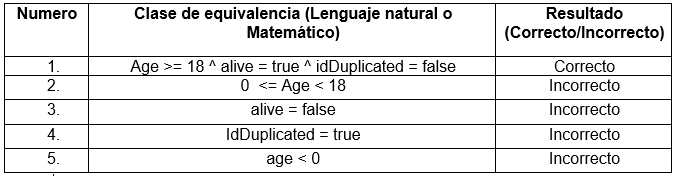
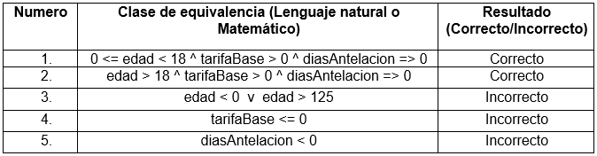
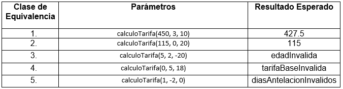
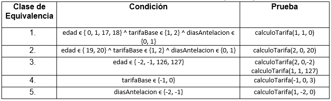

# Laboratorio 3 - PBT - 2020-1

* Universidad: _Escuela Colombiana de Ingeniería_
* Asignatura:  _Ciclos de Vida de Desarrollo de Software_
* Autor: _Davor Cortés_

## Pruebas de Caja Blanca
---
* Técnica de Clases de Equivalencia\

## Pruebas de Caja Negra
---
* Técnica de Clases de Equivalencia\

* Diseño\

* Técnica del Límite\

En estas pruebas hace falta que el .jar incluya las Excepciones pertinentes para la funcion `calculoTarifa`.
